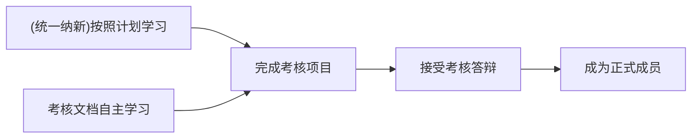

## Hey, this is us 👋

福州大学西二在线工作室，成立于1998年。 是集美貌与智慧于一身的学生组织。始于情怀，精于技术，重于传承。我们连接校内外优秀学生资源，帮助学生在互联网领域内有更好的发展，是提高个人能力，培养优秀人才的孵化器。

West2-online studio was established in 1998. It is a student organization that combines technology and wisdom. It starts with feelings, is proficient in technology, and is more important than inheritance. We connect outstanding student resources inside and outside the school to help students develop better in the Internet field. We are an incubator for improving personal abilities and cultivating outstanding talents.

## 加入我们

加入我们，你将会得到
1. 大厂学长的独门通关秘籍
2. 免费且强劲的工作室wifi/水/纸/**不受老师监管可以自由发挥的工位**
3. 定期的大额外包项目，为自己大学赚到第一桶金
4. 浓厚的学习氛围，一起学习最新的技术
5. 最新的秋/春招，以及不定期的大厂训练营/开源活动资讯

我们会在每年的9月统一进行宣讲纳新，通过为期一年的纳新考核，就可以成为我们的正式成员

当然，除此之外，我们也在探索新的发展路线，你可以选择这些方法加入我们
| 方案     | 详细内容                                                     |
| -------- | ------------------------------------------------------------ |
| 正常纳新 | 通过统一纳新，按照合理的计划安排逐步完成所有考核，并且通过考核答辩即可成为正式成员 |
| 提前批   | 通过统一纳新，提前完成所有考核任务，并通过考核答辩即可成为正式成员         |
| 黑马     | 不通过统一纳新，只要你**完成所有考核任务**即可直接联系我们，答辩通过后直接成为正式成员 |

我们公布了部分方向的考核计划，详细请参考我们组织公开的学习仓库（通常以`learn-`开头），考核顺序可以参考如下

关于更多，可以加入QQ群咨询:`765360777`，我们真诚期待你的到来
